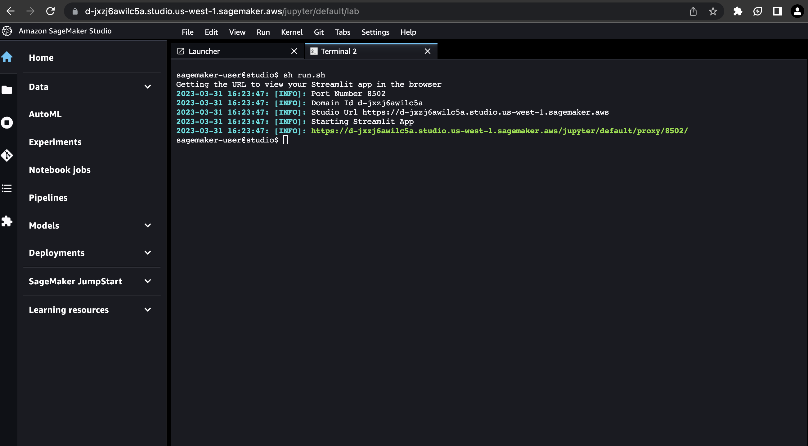

# AWS Cost Optimisation Chatbot Workshop

In this workshop, you will learn how to deploy, build and test a Generative AI chatbot with a streamit app in Amazon SageMaker Studio. 
As a practical example, we will be iterating on a pre-built chatbot that performs basic AWS cost optimisation on a cost and usage (CUR) sample report. 

## Workshop Content
1. First we will run through how to use Amazon Bedrock to contruct a prompt to analyze a cost and usage report and provide some basic recommendations.
2. Next we will extend the chatbot to utilise a knowledge base to enhance the cost optimisation recommendations.
3. Finally as an open ended workshop, you will fine tune the prompts and prompt chat to see if you can enhance the chatbot to provide specific cost and usage report recommendations.

## Getting Started

Before we begin, you will need to setup your Amazon SageMaker studio environment.

### Step 1: Setup your environment

1. In Amazon SageMaker Studio, select `File` -> `New` -> `Terminal`
2. Navigate to the app folder i.e. 
```
cd amazon-bedrock-cost-optimisation-chatbot/app
```
2. In the terminal, install the dependencies by running the following:

```
!pip install --no-cache-dir -r requirements.txt
```

### Step 2: Run your app
3. Verify that your app is correctly setup by running the following:

```
sh run.sh
```

The url and port number hosting the app will be displayed. Copy and paste the url in a new browser tab to preview your app.



### Step 3: Run your app in development mode
While developing, it might be helpful to automatically rerun the script when app.py is modified on disk. To do, so we can modify the runOnSave configuration option by adding the --server.runOnSave true flag to our command:

```
streamlit run app.py --server.runOnSave true
```

### Exercise 1: Write a system prompt that will analyze a cost and usage

In this exercise, you will be writing a prompt in the `system_prompt` variable in the `app.py` file to instruct the Generative AI model to analyze a cost and usage report provided in a `<AWS_cost_usage_report>` tag and answer a question in the `<question>` tag. You must also instruct the model to return the answer in an `<answers>` tags.

You can also optionally ask the model to provide it's thought process by saving it a `<thinking>` tag.

Once you have updated it, refresh your strealit app and test it.

### Exercise 2: Update your chat app to utilise an Amazon Bedrock knowledge base to enhance your cost optimisation recommendation
    
In this exercise, you will be:

1. Creating a knowledge base with Amazon Bedrock knowledge base
2. Setting up your streamlit app to utilise the knowledge base
3. Review how the app uses the knowledge base to retrieve information relevant to cost optimisation
4. Update your `system_prompt` variable to take the knowledge base into consideration
    
    
#### Step 1: Setup knowledge base
    
In the `amazon-bedrock-cost-optimisation-chatbot` folder, open the notebook `Create_knowledge_base.ipynb` and run through the steps to setup your knowledge base

#### Step 2: Setup your streamlit with the knowledge base feature

Open the `configs.json` and set the following

1. Set `knowledge_base_enabled` to true
2. Set your knowledge base id `knowledge_base_id` to the knowledge base you just created

#### Step 3: Update your system prompt to take the knowledge base information into consideration

In this section, you will be updating the `system_prompt` variable in the `app.py` file to take the information from the knowledge base into consideration. 

To get started, first review the `utils/llm.py` to `get_policies` function to understand how it is retrieving the information from the knowledge base. This information will be populated into the `<policies>` tag. Once you understand how this work, update the `system_prompt` variable to take the policies information into account.

Once you have updated it, refresh your strealit app and test it.

### Exercise 3: Improve the cost optimisation chatbot

Now that you have ran through the basics of implementing a streamlit app with a Amazon Bedrock and a knowledge base, see if you can enhance the chatbot to perform better cost optimisations. Some suggestions to get you started:

1. Enhance system prompt or chain multiple prompts to improve the recommendation
2. Improve how the application reads the cost and usage report (Hint: the current implementation is limited to the first 2000 records due to Claude's context limitation, see if you can improve this with function calling and csv queries - reference: https://github.com/anthropics/anthropic-cookbook/blob/main/tool_use/function_calling.ipynb)
3. Enhance the knowledge base with more information (i.e. upload more documents)
4. Implement tooling to query external data sources to improve context

### Clean up
Once we are done using the app, we want to free up the listening ports. To get all the processes running streamlit and free them up for use we can run our cleanup script: 
```
sh cleanup.sh
```