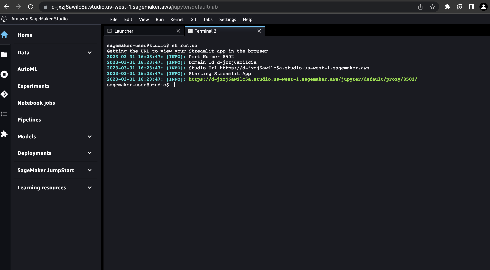

# AWS Cost Optimisation Chatbot Workshop

In this workshop, you will learn how to deploy, build and test a Generative AI chatbot with a streamit app in Amazon SageMaker Studio. 
As a practical example, we will be iterating on a pre-built chatbot that performs basic AWS cost optimisation on a cost and usage (CUR) sample report. 

## Workshop Content
1. First we will run through how to use Amazon Bedrock to contruct a prompt to analyze a cost and usage report and provide some basic recommendations.
2. Next we will extend the chatbot to utilise a knowledge base to enhance the cost optimisation recommendations.
3. Finally as an open ended workshop, you will fine tune the prompts and prompt chat to see if you can enhance the chatbot to provide specific cost and usage report recommendations.

## Getting Started

Before we begin, you will need to setup your Amazon SageMaker studio environment.

### Step 1: Setup your environment

1. In Amazon SageMaker Studio, select `File` -> `New` -> `Terminal`
2. In the terminal, install the dependencies by running the following:

```
!pip install --no-cache-dir -r requirements.txt
```

### Step 2: Run your app
3. Verify that your app is correctly setup by running the following:

```
sh run.sh
```

The url and port number hosting the app will be displayed. Copy and paste the url in a new browser tab to preview your app.



### Step 3: Run your app in development mode
While developing, it might be helpful to automatically rerun the script when app.py is modified on disk. To do, so we can modify the runOnSave configuration option by adding the --server.runOnSave true flag to our command:

```
streamlit run app.py --server.runOnSave true
```

### Exercise 1: Write a system prompt that will analyze a cost and usage

In this exercise, you will be writing a prompt in the `system_prompt` variable in the `app.py` file to instruct the Generative AI model to analyze a cost and usage report provided in a `<AWS_cost_usage_report>` tag and answer a question in the `<question>` tag. You must also instruct the model to return the answer in an `<answers>` tags.

You can also optionally ask the model to provide it's thought process by saving it a `<thinking>` tag.

Once you have updated it, refresh your strealit app and test it.

### Exercise 2: Update your app to retrieve information from a knowledge base to enhance your cost optimisation recommendation
    
In this exercise, you will be:

1. Creating a knowledge base with Amazon Bedrock knowledge base
2. Setting up your streamlit app to utilise the knowledge base
3. Review how the app uses the knowledge base to retrieve information relevant to cost optimisation
4. Update your `system_prompt` variable to take the knowledge base into consideration
    
    
#### Step 1: Setup knowledge base
    
1. In the AWS console, create an S3 bucket
2. Upload sample knowledge base document to your s3 bucket
```
aws s3 sync knowledge-base-sample s3://<your-s3-bucket>
```

3. In the AWS console, go to Amazon Bedrock -> Knowledge bases and click `Create knowledge base`
    For the Knowledge base name, enter `aws-cost-optimisation-knowledge-base`
    For runtime role, select `Create and use a new service role`
    Click `Next`
4. For data source name enter `cost-optimisation-documents` and in `S3 URI`, click `Browse S3` and select the S3 bucket that you created.
5. For Embeddings model, select `Titan Embeddings G1 - Textv1.2` or an English embedding models that is available and click `Next`
6. Review confgurations and click `Create knowledge base`
7. Once your knowledge base has been created you will need to synchronise your knowledge base with the data in S3, 


### Clean up
Once we are done using the app, we want to free up the listening ports. To get all the processes running streamlit and free them up for use we can run our cleanup script: 
```
sh cleanup.sh
```